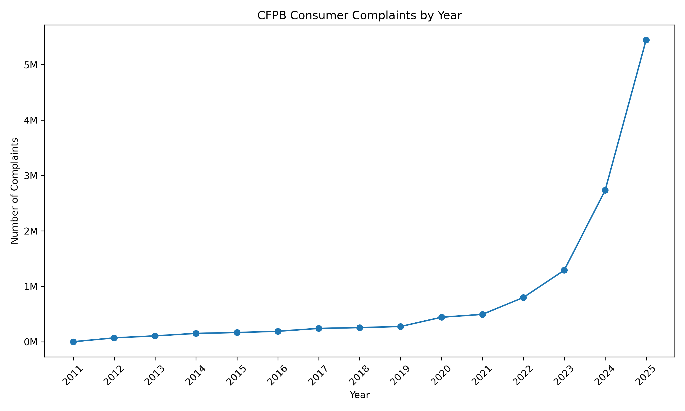

# consumer-finance-big-data-analysis
Large-scale consumer finance analysis using Python, SQL, and PySpark with the CFPB Consumer Complaint Database.
## Tools & Skills

- Python
- PySpark
- Spark SQL
- Pandas
- Matplotlib
- Large-scale data analysis
- Data aggregation
- Data visualization
  
## Key Findings

- Analyzed approximately **17.3 million consumer complaints** using PySpark and Spark SQL.
- Credit-reporting complaints dominated the dataset, with TransUnion, Equifax, and Experian having the highest complaint counts.
- Complaint volume increased sharply in recent years, rising from about **800,000 complaints in 2022** to more than **5.4 million in 2025**.
- Companies recorded timely responses for the overwhelming majority of complaints.
  
## Complaint Trend

The CFPB Consumer Complaint Database shows a sharp increase in complaint volume in recent years, especially from 2022 through 2025.

> 2026 is excluded from the chart because the dataset contains only a partial year.
